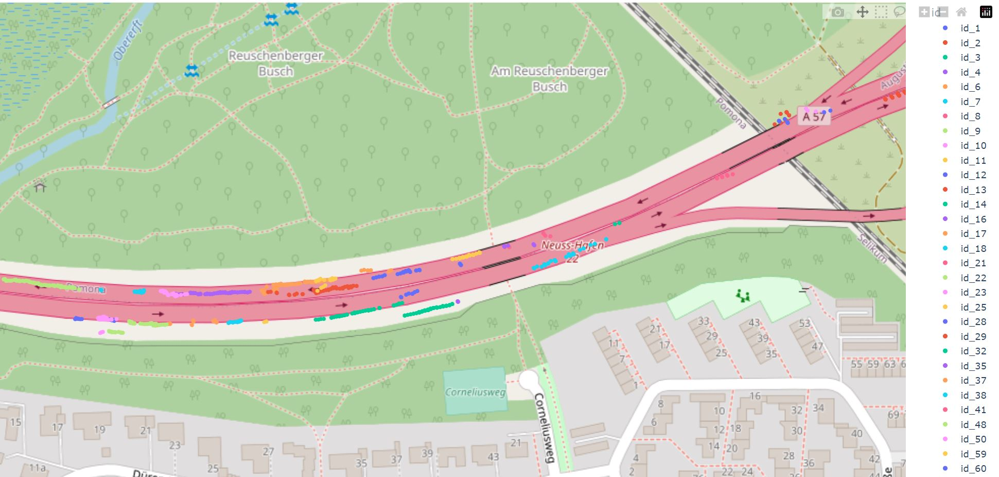
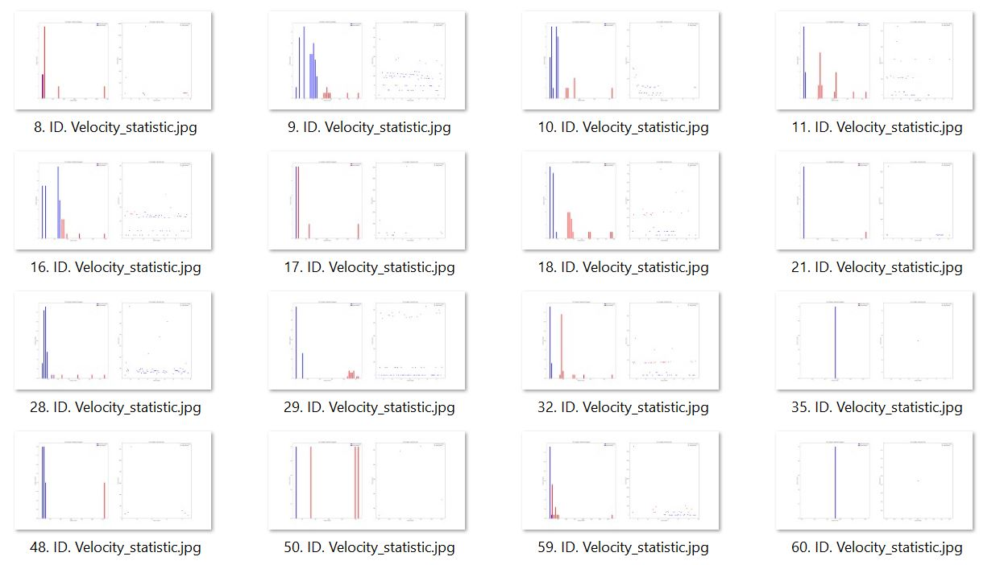

# drone_object_tracking

Object tracking implemented with YOLOv4, DeepSort and TensorFlow. YOLOv4 is a state of the art algorithm that uses deep convolutional neural networks to perform object detections. We can take the output of YOLOv4 feed these object detections into Deep SORT (Simple Online and Realtime Tracking with a Deep Association Metric) in order to create a highly accurate object tracker.

We can transform the image coordinates in world koordinate. With this we can represent on the map the location of objects and their IDs.

Using the location of the objects and the FPS of the video, find the speed of each object (vehicle)

## Demo of Object Tracker on Vehicles using Drones
<p align="center"></p>

<p align="center"></p>

<p align="center"></p>

## Getting Started

### Pip
Install packages
```sh
$ pip install -r requirements.txt
```

### Downloading Official YOLOv4 Pre-trained Weights
Our object tracker uses YOLOv4 to make the object detections, which deep sort then uses to track. There exists an pre-trained YOLOv4 object detector model of VisDrone Dataset that is able to detect 11 classes. For easy demo purposes we will use the pre-trained weights for our tracker.

1. Download pre-trained mars-small128.pb file:
https://drive.google.com/file/d/1IEIPpf4QJ6wn1L6wR0PaAUJuU7QyMxU4/view?usp=share_link 
Copy and paste mars-small128.pb from your downloads folder into the 'model_data/' folder of this repository.

2. Download yolov4-416.zip file:
https://drive.google.com/file/d/1200u6Y20Y3O2KbiXyvj3fDSG5A9Ua0HR/view?usp=share_link
Copy and paste yolov4-416.zip from your downloads folder into the 'checkpoints/' folder of this repository.


### Running 

Run yolov4 deep sort object tracker on video

```sh
$ python object_tracker.py
```

Transform the image coordinates in world koordinate.
Mark any four points on the image and then write their corresponding coordinates on the world map

```sh
$ python coordinate_transform.py
```

Represent on the map the location of objects and their IDs

```sh
$ python map_plot.py
```

Calculate the velocity for each vehicle and save it in the outputs folder

```sh
$ python object_velocity.py
```


### References  

   Huge shoutout goes to hunglc007, nwojke and aiskyeye.com for creating the backbones of this repository:
  * [tensorflow-yolov4-tflite](https://github.com/hunglc007/tensorflow-yolov4-tflite)
  * [Deep SORT Repository](https://github.com/nwojke/deep_sort)
  * [VisDrone Dataset](http://aiskyeye.com/)